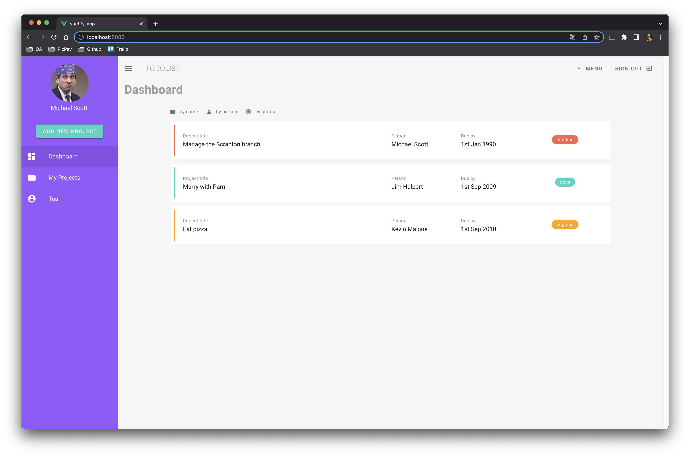

# Vuetify app

Project developed using Vue.js with Vuetify
- Vue.js 2
- Vuex 3
- Vue router 3
- Vuetify 2



## Project setup
```
npm install
```

### Compiles and hot-reloads for development
```
npm run serve
```

### Customize configuration
See [Configuration Reference](https://cli.vuejs.org/config/).
